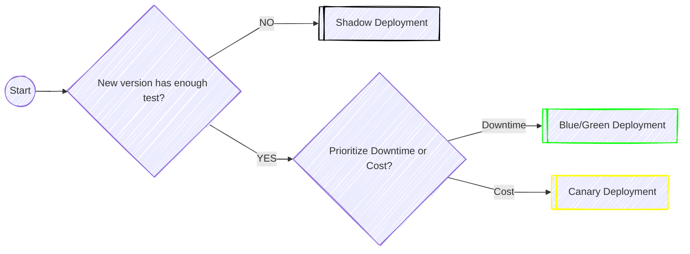

# Decision Chart

```mermaid
---
config:
  look: handDrawn
  theme: default
  themeVariables:
    darkMode: false
    background: #ffffff
  flowchart:
    curve: linear
---
flowchart LR
    Start@{
        shape: circle
    }


    BUG@{
        shape: diamond
        label: New version has enough test?
    }

    SD@{
        shape: lin-rect
        label: Shadow Deployment
    }

    DT@{
        shape: diamond
        label: Prioritize Downtime or Cost?
    }

    BG@{
        shape: lin-rect
        label: Blue/Green Deployment
    }

    CD@{
        shape: lin-rect
        label: Canary Deployment
    }
    
    classDef Blue stroke:#00f
    classDef Green stroke:#0f0
    classDef Red stroke:#f00
    classDef Yellow stroke:#ff0
    classDef Black stroke:#000

    Start --> BUG
    BUG --YES--> DT
    BUG --NO--> SD:::Black
    

    DT --Downtime-->BG:::Green
    DT --Cost-->CD:::Yellow
```
